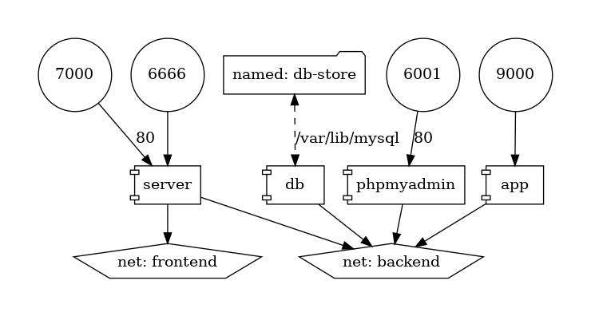

# Technologie Chmurowe - L9
## Zadanie P9.2
Autor: Łukasz Burzak


### Budowanie i uruchamianie usługi
```shell
docker compose build
docker compose up
```

### Dostęp do usługi

Strona główna jest serwowana pod adresem http://127.0.0.1:6666.
Port 6666 jest jednak zastrzeżony w nowszych przeglądarkach. Działanie usługi można potwierdzić za pomocą polecenia `curl`.

Aplikacja phpMyAdmin jest dostępna pod adresem http://127.0.0.1:6001. Logowanie odbywa się za pomocą danych root:root. Po zalogowaniu można utworzyć testową bazę danych.


### Reprezentacja graficzna architektury

Diagram może wygenerować aplikacja w kontenerze `pmsipilot/docker-compose-viz`:
```shell
docker run --rm -it --name dcv -v ${PWD}:/input pmsipilot/docker-compose-viz render -m image docker-compose.yml --output-file=graph.png --force
```

Wynik:
